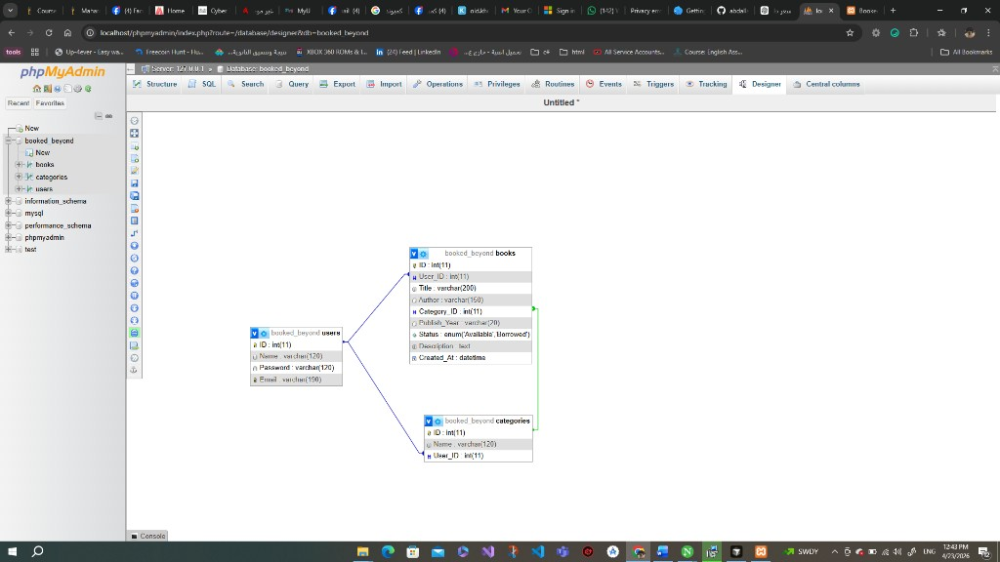

# Booked Beyond (PHP + MySQL + Bootstrap)

Booked Beyond is a personal book library web app.  
It helps each user organize books, track borrowing status, and manage categories with a simple dashboard.

## Features
- User registration and login
- Session-based authentication with "Remember me"
- Personal library per user (data isolation by account)
- Add new books with:
  - Title
  - Author
  - Category
  - Publish year
  - Description
- Edit and delete books
- Toggle book status between `Available` and `Borrowed`
- Search books by title, author, or category
- Manage custom book categories (add/delete)
- Library history page with date filter

## Pages
- `index.php`: Home dashboard
- `Library.php`: Main library list and actions
- `AddBook.php`: Add a new book
- `EditBook.php`: Edit an existing book
- `Categories.php`: Manage categories
- `History.php`: View books by creation date
- `Login.php` / `Register.php`: Authentication

## Database Schema

